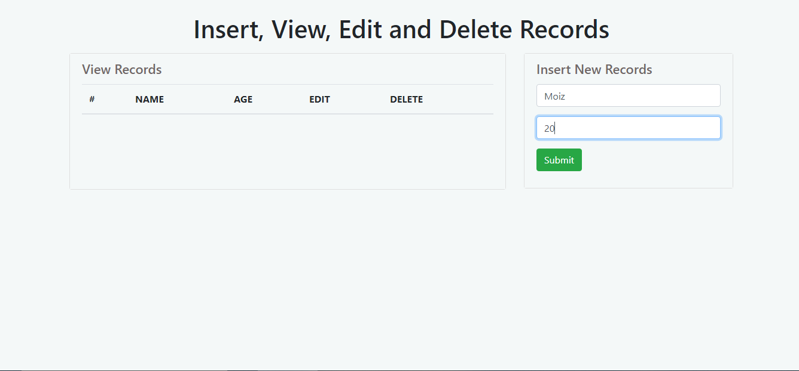
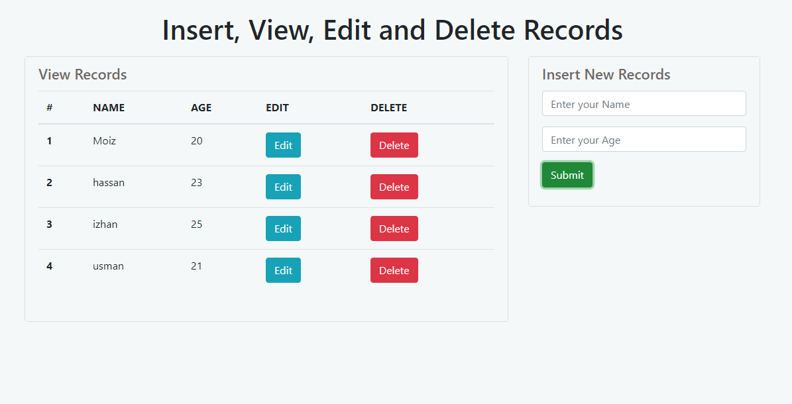
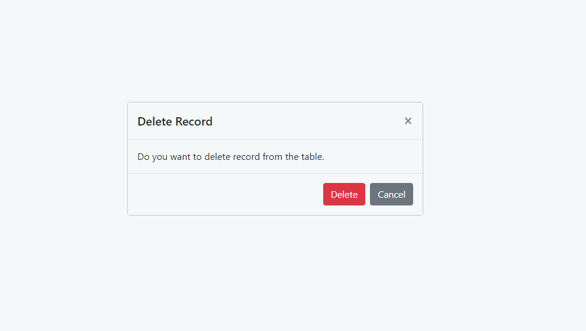
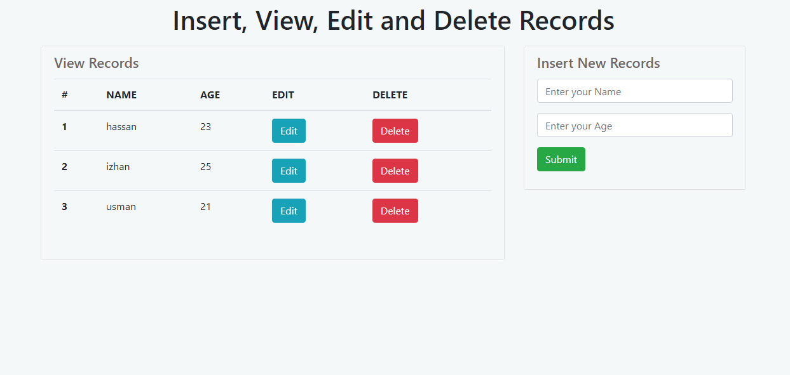
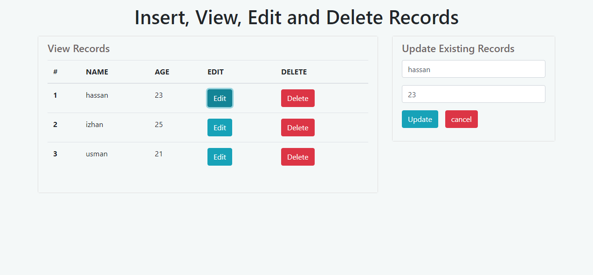
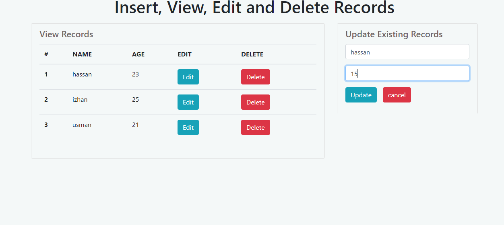
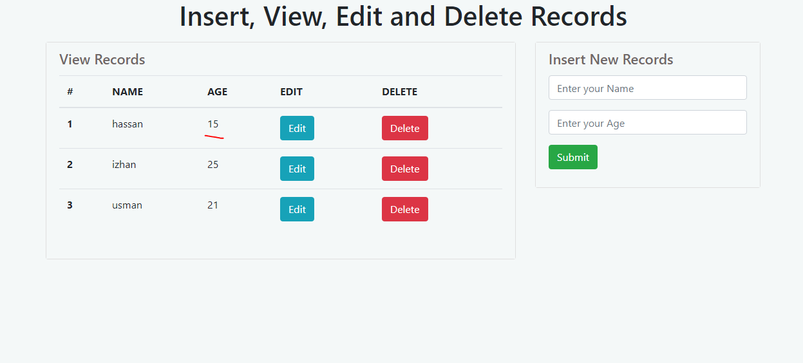

# CRUD---Javascript-HTML5-CSS3

## App includes CRUD OPERATION
 * Insert
 * View
 * Update
 * Delete
 
 
 ## INSERT Opertion
 
 ### This Operation Takes Input From the Input Fields and add records in the table also set the records in the Local Storage.
 
 ##### Fill the input Fields
 
 
 ##### After Submit the data start Showing in the table, also after the a refresh beacuse the data set in Local Storage. 
 
 
 
 ## Delete Opertion
 ### This Operation Takes Place when delete button is pressed from the table to delete the record from table and from Local Storage.
 
 ##### On click the delete, a confirmation dialog appears to confirm the delete operation.
 
 
 ##### On click confirm the data disappear from the table and also delete from Local Storage, also if clicked cancel no row deleted from the table and in Local Storage.
 
 
 
  ## Update Opertion
  ### This Operation Takes Place when edit button is pressed from the table to update the record from table and from Local Storage.
  
  ##### On click the edit button, the respective row data show in the input fields to make change in the data, also the button are changed in the operation.
  
 
  ##### Now you can change the data in the input fields to update 
  
  
  ##### Now, on click Update the data will update in the table as well as in the Local Storage as shown in the figure, also if clicked cancel no row update from the table and in Local Storage.
  
